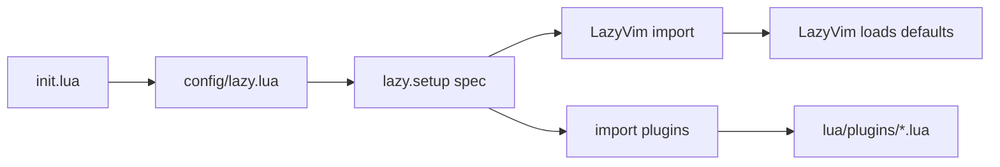

# Neovim config codebase explanation

## How Neovim loads this config

1. Neovim starts and runs **[init.lua](init.lua)** (single line: `require("config.lazy")`).
2. If both `init.lua` and **[init.vim](init.vim)** exist, **Neovim uses `init.lua` and does not run `init.vim`**. Your `init.vim` looks like an older vim-plug/pathogen setup; treat it as reference or backup, not the active config.

## Lazy.nvim and LazyVim (the two layers)

- **[lua/config/lazy.lua](lua/config/lazy.lua)** bootstraps the `lazy.nvim` plugin manager (clones it under `stdpath("data")/lazy/lazy.nvim` if missing), prepends it to `runtimepath`, then calls `require("lazy").setup({ ... })`.
- The `spec` merges:
  - `{ "LazyVim/LazyVim", import = "lazyvim.plugins" }` — entire LazyVim distribution (defaults, extras mechanism, many plugins).
  - `{ import = "plugins" }` — every `*.lua` file under **[lua/plugins/](lua/plugins/)** is merged as plugin definitions.

**Lua pattern you will see everywhere:** each plugin file usually `**return { ... }`** — a table (or list of tables) describing plugins. That return value is what `lazy.nvim` consumes. Example: **[lua/plugins/_custom.lua](lua/plugins/_custom.lua)** adds simple `{ "author/repo" }` entries and disables others with `enabled = false`.

## Where your “real” settings live

| Area                      | File                                                                 | Role                                                                                                                                                 |
| ------------------------- | -------------------------------------------------------------------- | ---------------------------------------------------------------------------------------------------------------------------------------------------- |
| Options                   | [lua/config/options.lua](lua/config/options.lua)                     | `vim.opt`, `vim.g`, autocmds. LazyVim loads this automatically (same as keymaps).                                                                    |
| Keymaps                   | [lua/config/keymaps.lua](lua/config/keymaps.lua)                     | Custom `map()` helper avoids clashing with Lazy’s deferred key handlers; returns `M` at end (LazyVim convention for extendable modules).             |
| Lazy bootstrap            | [lua/config/lazy.lua](lua/config/lazy.lua)                           | Plugin manager + `defaults.lazy = false` for custom plugins (they load at startup unless each spec sets `event`/`keys`/etc.).                        |
| CodeCompanion workarounds | [lua/config/codecompanion-fix.lua](lua/config/codecompanion-fix.lua) | Monkey-patches loaded CodeCompanion modules for nil-safety; wired from [lua/plugins/editor-codecompanion.lua](lua/plugins/editor-codecompanion.lua). |

LazyVim’s own defaults (options/keymaps you did not override) live upstream in the LazyVim repo — your files at the top link to those in comments.

## `lua/plugins/` layout (by filename theme)

Files are **grouped by concern**, not by a single index file:

- **colorscheme-*.lua** — themes (Catppuccin, Tokyo Night, tint).
- **editor-*.lua** — editing (conform, lint, treesitter, hop, oil, etc.).
- *lsp.lua** — LSP: shared [lspconfig.lua](lua/plugins/lspconfig.lua) plus language-specific extras (TypeScript, Java, Go).
- **ui-*.lua** — statusline, notifications, splits, etc.
- **picker-*.lua**, **navigation-*.lua**, **git-*.lua**, *testing.lua** — self-explanatory.
- **[lua/plugins/lazy.lua](lua/plugins/lazy.lua)** — empty `return {}` (placeholder; real lazy setup is `config/lazy.lua`).

## Small Lua concepts that matter here

- `**require("module")`** — loads and runs `lua/module.lua` (or `lua/module/init.lua`) once, caches the return value.
- `**vim.opt` / `vim.o` / `vim.g`** — options and global variables.
- `**vim.keymap.set(mode, lhs, rhs, opts)`** — defines mappings; `opts.desc` feeds which-key-style UIs.
- **Plugin spec fields** (lazy.nvim): `dependencies`, `config = function() ... end`, `event`, `keys`, `ft`, `cmd`, `opts = {}` (passed to `require("plugin").setup(opts)` when `main` is set), `enabled = false` to turn off a plugin.

## README vs disk

[README.md](README.md) documents structure; you also have **[bin/lazygit-edit.sh](bin/lazygit-edit.sh)** (not always mentioned in the short structure block).

---

## Optional follow-up: more comments for learning

If you want **after you approve implementation**, add short “why this exists” comments only where it helps a beginner:

1. **[init.lua](init.lua)** — one line explaining it is the only startup file Neovim runs first.
2. **[lua/config/lazy.lua](lua/config/lazy.lua)** — brief note on `spec` merge order (LazyVim first, then `plugins/`).
3. **[lua/plugins/_custom.lua](lua/plugins/_custom.lua)** — line comments on `enabled = false` vs adding plugins.

Avoid duplicating long comments in every plugin file; [lspconfig.lua](lua/plugins/lspconfig.lua) already has extensive LSP explanation.

No code changes are required for understanding; comments are optional polish.
